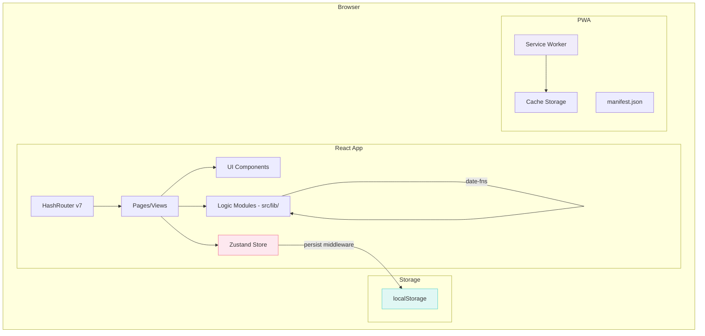
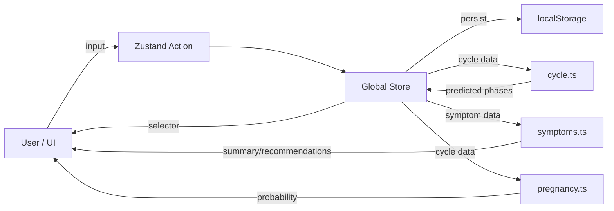
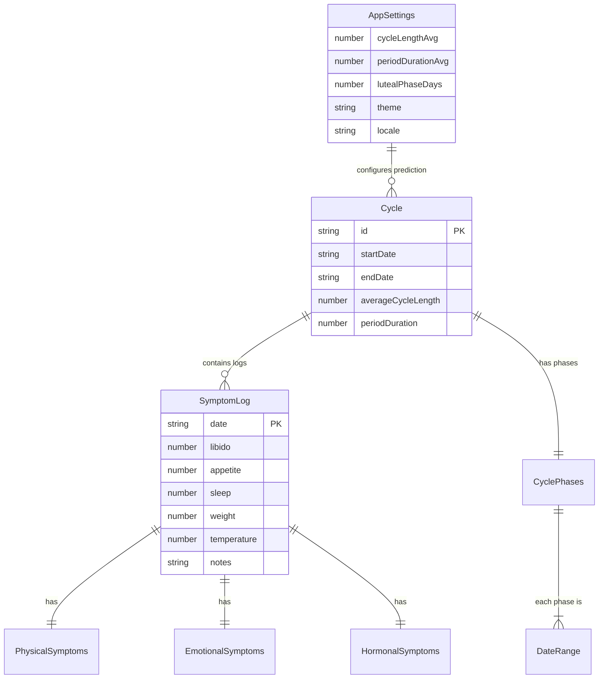

# Design Document — Menstrual Cycle Tracker

## Overview

This document describes the technical design of the menstrual cycle tracking PWA application. The application is 100% frontend, with no backend, and persistence exclusively in localStorage. It is built with React 19, TypeScript 5, Vite 6, Tailwind CSS v4, Zustand 5, date-fns 4, and Recharts 2.

The architecture follows an SPA (Single Page Application) pattern with hash-based routing (HashRouter) for GitHub Pages compatibility. Global state is managed with Zustand and automatically synchronized with localStorage via the `persist` middleware. Business logic (phase prediction, pregnancy probability calculation, anomaly detection) is encapsulated in pure modules within `src/lib/`.

---

## Architecture

### High-Level Architecture Diagram



### Data Flow Diagram




### Folder Structure

```
src/
├── main.tsx                    # Entry point
├── App.tsx                     # Main Router
├── pages/
│   ├── Dashboard.tsx           # /#/
│   ├── Calendar.tsx            # /#/calendar
│   ├── DailyLog.tsx            # /#/log
│   ├── History.tsx             # /#/history
│   ├── Insights.tsx            # /#/insights/:cycleId
│   └── Settings.tsx            # /#/settings
├── components/
│   ├── layout/
│   │   ├── Sidebar.tsx
│   │   ├── MobileMenu.tsx
│   │   └── Layout.tsx
│   ├── calendar/
│   │   ├── MonthView.tsx
│   │   ├── WeekView.tsx
│   │   ├── DayCell.tsx
│   │   └── Legend.tsx
│   ├── forms/
│   │   ├── SymptomForm.tsx
│   │   ├── ScaleInput.tsx
│   │   ├── SelectInput.tsx
│   │   └── TagInput.tsx
│   ├── charts/
│   │   ├── CycleDurationChart.tsx
│   │   ├── SymptomRadarChart.tsx
│   │   ├── VariationBarChart.tsx
│   │   └── PhaseSummaryChart.tsx
│   ├── dashboard/
│   │   ├── CyclePhaseCard.tsx
│   │   ├── PregnancyBadge.tsx
│   │   ├── RecommendationCards.tsx
│   │   └── QuickStats.tsx
│   └── shared/
│       ├── Badge.tsx
│       ├── Card.tsx
│       ├── Button.tsx
│       ├── Modal.tsx
│       └── Toast.tsx
├── store/
│   ├── useCycleStore.ts
│   ├── useSymptomStore.ts
│   └── useSettingsStore.ts
├── lib/
│   ├── cycle.ts
│   ├── symptoms.ts
│   ├── pregnancy.ts
│   ├── storage.ts
│   ├── recommendations.ts
│   └── seed.ts
├── i18n/
│   ├── index.ts              # i18n setup and hook
│   ├── en.ts                 # English translations
│   └── es.ts                 # Spanish translations
├── types/
│   └── index.ts
└── hooks/
    ├── useCurrentPhase.ts
    ├── usePregnancyProbability.ts
    └── useResponsive.ts
```

---

## Components and Interfaces

### Store (Zustand)

#### useCycleStore

```typescript
interface CycleStoreState {
  cycles: Cycle[];
  activeCycleId: string | null;
}

interface CycleStoreActions {
  startNewCycle: (startDate: string) => void;
  endCurrentCycle: (endDate: string) => void;
  recalculatePhases: (cycleId: string, settings: AppSettings) => void;
  getActiveCycle: () => Cycle | null;
  getCycleHistory: () => Cycle[];
  getAverageCycleLength: (count?: number) => number;
  getAnomalies: () => Cycle[];
  getTrend: () => 'shortening' | 'lengthening' | 'stable';
}
```

#### useSymptomStore

```typescript
interface SymptomStoreState {
  logs: SymptomLog[];
}

interface SymptomStoreActions {
  saveLog: (log: SymptomLog) => void;
  getLogByDate: (date: string) => SymptomLog | undefined;
  getLogsByDateRange: (start: string, end: string) => SymptomLog[];
  deleteLog: (date: string) => void;
}
```

#### useSettingsStore

```typescript
interface SettingsStoreState {
  settings: AppSettings;
  onboardingComplete: boolean;
  locale: 'en' | 'es';
}

interface SettingsStoreActions {
  updateSettings: (partial: Partial<AppSettings>) => void;
  completeOnboarding: () => void;
  exportData: (format: 'json' | 'csv') => void;
  importData: (data: string) => { success: boolean; error?: string };
  resetToDefaults: () => void;
  setLocale: (locale: 'en' | 'es') => void;
}
```

### Logic Modules (src/lib/)

#### cycle.ts — Phase Prediction

```typescript
/**
 * Calculates cycle phases based on start date,
 * cycle length, and luteal phase duration.
 * 
 * Algorithm:
 * 1. Menstrual phase: startDate → startDate + periodDuration - 1
 * 2. Ovulation day: startDate + cycleLength - lutealPhaseDays - 1
 * 3. Ovulation phase: ovulationDay - 1 → ovulationDay + 1
 * 4. Follicular phase: end of menstruation + 1 → start of ovulation - 1
 * 5. Luteal phase: end of ovulation + 1 → startDate + cycleLength - 1
 */
function predictPhases(
  startDate: string,
  cycleLength: number,
  periodDuration: number,
  lutealPhaseDays: number
): CyclePhases;

/**
 * Calculates the average duration of the last N completed cycles.
 * Clamps the result to the range [26, 30].
 */
function calculateAverageCycleLength(
  cycles: Cycle[],
  count: number
): number;

/**
 * Determines the current cycle phase for a given date.
 */
function getCurrentPhase(
  date: string,
  cycle: Cycle
): 'menstrual' | 'follicular' | 'ovulation' | 'luteal' | null;

/**
 * Detects anomalous cycles: deviation > 7 days from average.
 */
function detectAnomalies(
  cycles: Cycle[],
  averageLength: number
): Cycle[];

/**
 * Calculates cycle trend: shortening, lengthening, or stable.
 * Compares average of last 3 vs previous 3.
 * Difference >= 2 days = trend. Less = stable.
 */
function calculateTrend(
  cycles: Cycle[]
): 'shortening' | 'lengthening' | 'stable';
```

#### pregnancy.ts — Pregnancy Probability

```typescript
/**
 * Calculates pregnancy probability for a given day in the cycle.
 * 
 * Algorithm:
 * 1. ovulationDay = cycleLength - lutealPhaseDays
 * 2. currentDayInCycle = differenceInDays(targetDate, cycleStartDate) + 1
 * 3. distance = currentDayInCycle - ovulationDay
 * 
 * Levels:
 * - High: |distance| <= 2 (fertile window: 5 total days)
 * - Medium: distance between -5 and -3 (3-5 days before ovulation)
 * - Low: any other day
 */
function calculatePregnancyProbability(
  targetDate: string,
  cycleStartDate: string,
  cycleLength: number,
  lutealPhaseDays: number
): 'high' | 'medium' | 'low';

/**
 * Determines if there is enough data to show the probability.
 */
function canShowPregnancyProbability(
  activeCycle: Cycle | null
): boolean;
```

#### symptoms.ts — Summary and Grouping

```typescript
/**
 * Generates a symptom summary grouped by cycle phase.
 * Calculates the arithmetic mean of intensity per category
 * excluding days without records.
 */
function generatePhaseSummary(
  logs: SymptomLog[],
  phases: CyclePhases
): PhaseSummary;

/**
 * Checks if a cycle has enough data for a reliable summary.
 * Requires a minimum of 7 days with records.
 */
function hasEnoughDataForSummary(
  logs: SymptomLog[],
  cycle: Cycle
): boolean;

/**
 * Calculates physical and emotional symptom averages
 * for a given date range.
 */
function calculateAverageSymptoms(
  logs: SymptomLog[],
  startDate: string,
  endDate: string
): { physical: PhysicalAverages; emotional: EmotionalAverages } | null;
```

#### recommendations.ts — Wellness Recommendations

```typescript
/**
 * Generates recommendations based on recorded symptoms.
 * Only for symptoms with intensity >= 3.
 * Maximum 5 recommendations, ordered by symptom intensity.
 */
function getRecommendations(
  log: SymptomLog
): Recommendation[];

/**
 * Gets preventive recommendations for the menstrual phase.
 * Maximum 3 general recommendations.
 */
function getMenstrualPhaseRecommendations(): Recommendation[];

/**
 * Recommendations map by symptom.
 * Minimum 3 recommendations per physical symptom type,
 * covering at least 2 categories (physical, natural, pharmaceutical).
 */
const RECOMMENDATIONS_MAP: Record<PhysicalSymptomKey, Recommendation[]>;
```

#### storage.ts — Persistence Helpers

```typescript
/**
 * Validates the localStorage data structure against defined types.
 */
function validateStorageData(data: unknown): ValidationResult;

/**
 * Exports all data to JSON or CSV.
 * The filename includes the export date.
 */
function exportAllData(format: 'json' | 'csv'): void;

/**
 * Imports data from a JSON file.
 * Validates structure before overwriting.
 */
function importData(jsonString: string): ImportResult;

/**
 * Checks if localStorage has available space.
 * localStorage has a typical limit of ~5MB.
 */
function checkStorageAvailability(): boolean;
```

### Custom Hooks

```typescript
/**
 * Hook that returns the current cycle phase and its metadata.
 */
function useCurrentPhase(): {
  phase: 'menstrual' | 'follicular' | 'ovulation' | 'luteal' | null;
  dayInCycle: number;
  daysUntilNextPhase: number;
  phaseColor: string;
};

/**
 * Hook that returns the current pregnancy probability.
 */
function usePregnancyProbability(): {
  level: 'high' | 'medium' | 'low' | null;
  canShow: boolean;
};

/**
 * Hook for detecting responsive breakpoints.
 */
function useResponsive(): {
  isMobile: boolean;    // <= 768px
  isTablet: boolean;    // <= 1024px
  isDesktop: boolean;   // > 1024px
};
```

### i18n Module

```typescript
/**
 * Translation keys organized by namespace.
 * Each language file exports this structure.
 */
interface Translations {
  nav: { dashboard: string; calendar: string; dailyLog: string; history: string; settings: string };
  phases: { menstrual: string; follicular: string; ovulation: string; luteal: string };
  symptoms: { physical: Record<keyof PhysicalSymptoms, string>; emotional: Record<keyof EmotionalSymptoms, string> };
  flow: Record<FlowLevel, string>;
  mucus: Record<MucusType, string>;
  pregnancy: { high: string; medium: string; low: string; disclaimer: string };
  common: { save: string; cancel: string; delete: string; export: string; import: string; };
  errors: Record<string, string>;
  emptyStates: Record<string, string>;
}

/**
 * Hook that returns the current translation function.
 * Uses useSettingsStore internally to get locale.
 */
function useTranslation(): {
  t: (key: string) => string;
  locale: 'en' | 'es';
};
```

---

## Data Models

### Main Types

```typescript
// === CYCLE ===

interface Cycle {
  id: string;                    // UUID generated with crypto.randomUUID()
  startDate: string;             // ISO date (YYYY-MM-DD)
  endDate: string | null;        // null if active cycle
  periodDays: string[];          // Days with bleeding (ISO dates)
  phases: CyclePhases;
  averageCycleLength: number;    // Average at creation time
  periodDuration: number;        // Actual menstruation days
}

interface CyclePhases {
  menstrual:   DateRange;
  follicular:  DateRange;
  ovulation:   DateRange;
  luteal:      DateRange;
}

interface DateRange {
  start: string;  // ISO date
  end: string;    // ISO date
}

// === SYMPTOM LOG ===

interface SymptomLog {
  date: string;                  // ISO date (YYYY-MM-DD) - primary key
  physical: PhysicalSymptoms;
  emotional: EmotionalSymptoms;
  hormonal: HormonalSymptoms;
  libido: number;                // 0-5
  appetite: number;              // 0-5
  sleep: number;                 // 0-24, increments of 0.5
  weight: number | null;         // 30.0-300.0, optional
  temperature: number | null;    // 35.0-42.0, BBT, optional
  notes: string;                 // Max 500 characters
  tags: string[];                // Max 10 tags, each max 30 chars
}

interface PhysicalSymptoms {
  cramps: number;                // 0-5
  backPain: number;              // 0-5
  headache: number;              // 0-5
  bloating: number;              // 0-5
  breastTenderness: number;      // 0-5
  fatigue: number;               // 0-5
  nausea: number;                // 0-5
  acne: number;                  // 0-5
}

interface EmotionalSymptoms {
  moodSwings: number;            // 0-5
  anxiety: number;               // 0-5
  sadness: number;               // 0-5
  irritability: number;          // 0-5
  energy: number;                // 0-5
}

interface HormonalSymptoms {
  flow: FlowLevel;
  cervicalMucus: MucusType;
}

type FlowLevel = 'none' | 'light' | 'medium' | 'heavy' | 'spotting';
type MucusType = 'dry' | 'sticky' | 'creamy' | 'eggWhite' | 'watery';

// === SETTINGS ===

interface AppSettings {
  cycleLengthAvg: number;        // 26-30, default 28
  periodDurationAvg: number;     // 3-7, default 5
  lutealPhaseDays: number;       // 14 (fixed per requirements)
  theme: 'light' | 'dark';
  firstDayOfWeek: 0 | 1;        // 0=Sunday, 1=Monday
  exportFormat: 'json' | 'csv';
  locale: 'en' | 'es';          // 'es' by default, detected from browser
}

// === RECOMMENDATIONS ===

interface Recommendation {
  id: string;
  symptom: PhysicalSymptomKey;
  category: 'physical' | 'natural' | 'pharmaceutical';
  text: string;
  icon?: string;
}

type PhysicalSymptomKey = keyof PhysicalSymptoms;

// === PHASE SUMMARY ===

interface PhaseSummary {
  menstrual: PhaseData | null;
  follicular: PhaseData | null;
  ovulation: PhaseData | null;
  luteal: PhaseData | null;
}

interface PhaseData {
  daysWithData: number;
  physicalAvg: Record<keyof PhysicalSymptoms, number>;
  emotionalAvg: Record<keyof EmotionalSymptoms, number>;
}

// === VALIDATION AND IMPORT ===

interface ValidationResult {
  valid: boolean;
  errors: string[];
}

interface ImportResult {
  success: boolean;
  error?: string;
  cyclesImported?: number;
  logsImported?: number;
}
```

### localStorage Schema

| Key | Type | Description |
|-----|------|-------------|
| `app-cycles` | `Cycle[]` | All cycles (active + history) |
| `app-symptoms` | `SymptomLog[]` | All daily logs |
| `app-settings` | `AppSettings` | User settings |
| `app-onboarding` | `boolean` | Whether onboarding was completed |

### Relationships Between Models



---


## Correctness Properties

*A property is a characteristic or behavior that must remain true across all valid executions of a system — essentially, a formal statement about what the system must do. Properties serve as a bridge between human-readable specifications and machine-verifiable correctness guarantees.*

### Property 1: SymptomLog Round-trip (save/load)

*For any* valid SymptomLog with date, physical symptoms (0-5), emotional symptoms (0-5), hormonal symptoms (valid enums), libido, appetite, sleep, weight, temperature, notes (≤500 chars) and tags (≤10, each ≤30 chars), saving it to the store and then retrieving it by date must produce an object identical to the original.

**Validates: Requirements 1.3, 1.7**

### Property 2: Input range validation

*For any* integer numeric value, the symptom validation function must accept values in the range [0, 5] and reject values outside that range. For sleep hours, it must accept [0, 24] in 0.5 increments. For weight, it must accept [30.0, 300.0] or null. For temperature, it must accept [35.0, 42.0] or null. For notes, it must accept strings of length ≤ 500 and reject longer strings. For tags, it must accept arrays of ≤ 10 elements where each tag has ≤ 30 characters.

**Validates: Requirements 1.4, 1.8, 1.9**

### Property 3: Cycle phase prediction invariants

*For any* valid start date, cycle length in [26, 30], menstruation duration in [3, 7], and luteal phase of 14 days, the `predictPhases` function must produce phases that: (a) cover all days of the cycle without gaps, (b) do not overlap each other, (c) the luteal phase has exactly 14 days, (d) the ovulation phase has exactly 3 days, and (e) the menstrual phase has the configured duration.

**Validates: Requirements 2.1, 2.3, 2.4, 2.5**

### Property 4: Average cycle duration calculation

*For any* array of 3 or more completed cycles with durations in the range [20, 40] days, the `calculateAverageCycleLength` function must return the arithmetic mean of the last N cycles, rounded to the nearest integer and clamped to the range [26, 30].

**Validates: Requirements 2.6, 2.8**

### Property 5: Symptom summary generation by phase

*For any* set of SymptomLogs within a cycle, the `generatePhaseSummary` function must: (a) calculate the arithmetic mean of each symptom using only the days with records within each phase, (b) return null for phases with no recorded days, and (c) return a valid summary only when the cycle has 7 or more days with records.

**Validates: Requirements 4.1, 4.2, 4.4, 4.6**

### Property 6: Recommendation generation by intensity

*For any* SymptomLog, the `getRecommendations` function must: (a) generate recommendations only for physical symptoms with intensity ≥ 3, (b) return a maximum of 5 recommendations, (c) group by symptom, and (d) order groups by descending intensity of the corresponding symptom.

**Validates: Requirements 5.1, 5.6**

### Property 7: Recommendations map completeness

*For each* physical symptom key (`cramps`, `backPain`, `headache`, `bloating`, `breastTenderness`, `fatigue`, `nausea`, `acne`), `RECOMMENDATIONS_MAP` must contain at least 3 recommendations covering at least 2 of the 3 defined categories (`physical`, `natural`, `pharmaceutical`).

**Validates: Requirements 5.2, 5.3**

### Property 8: Pregnancy probability classification

*For any* day within an active cycle, the `calculatePregnancyProbability` function must correctly classify: (a) 'high' if the distance to ovulation day is ≤ 2 in absolute value, (b) 'medium' if the distance is between -5 and -3 (3 to 5 days before ovulation), (c) 'low' for any other day of the cycle.

**Validates: Requirements 6.1, 6.2, 6.3, 6.4**

### Property 9: History average calculation

*For any* array of completed cycles, the averages calculation function must return the arithmetic mean of the durations of the last min(6, N) available cycles, where N is the total number of completed cycles.

**Validates: Requirements 7.2, 7.8**

### Property 10: Anomaly detection

*For any* array of completed cycles and their calculated average, the `detectAnomalies` function must identify as anomalies exactly those cycles whose duration deviates more than 7 days from the average (|duration - average| > 7).

**Validates: Requirements 7.4**

### Property 11: Variation calculation between consecutive cycles

*For any* sequence of 2 or more completed cycles, the variation between consecutive cycles must be the signed difference (duration[i+1] - duration[i]) for each adjacent pair.

**Validates: Requirements 7.5**

### Property 12: Cycle trend classification

*For any* sequence of 6 or more completed cycles, the `calculateTrend` function must classify: (a) 'shortening' if the average of the last 3 is at least 2 days less than the average of the previous 3, (b) 'lengthening' if it is at least 2 days greater, (c) 'stable' if the absolute difference is less than 2 days.

**Validates: Requirements 7.6**

### Property 13: Export/import round-trip

*For any* valid application state (cycles, symptoms, settings), exporting to JSON and then importing that JSON must restore a state equivalent to the original.

**Validates: Requirements 9.4, 9.5**

### Property 14: Safety against invalid import

*For any* invalid JSON string or with incorrect structure, the `importData` function must return an error and the existing data in localStorage must remain unmodified.

**Validates: Requirements 9.7**

### Property 15: Phase to color mapping

*For any* cycle phase ('menstrual', 'follicular', 'ovulation', 'luteal'), the color mapping function must return exactly the corresponding hex color: menstrual → #FA6364, follicular → #FFB04C, ovulation → #4ECDC4, luteal → #9B7ED8.

**Validates: Requirements 3.1**

### Property 16: Language switching preserves app state

*For any* valid application state (cycles, symptoms, settings) and any supported locale ('en' or 'es'), switching the locale must: (a) update all UI text keys without errors, (b) not modify any user data (cycles, symptoms, notes, tags), and (c) persist the new locale in AppSettings.

**Validates: Requirements 12.3, 12.4, 12.6**

---

## Error Handling

### Persistence Errors

| Scenario | Behavior |
|----------|----------|
| localStorage full (QuotaExceededError) | Show error toast indicating insufficient space. Keep data in form without losing it. Suggest exporting and clearing old data. |
| localStorage not available (incognito mode in some browsers) | Detect on initialization. Show persistent notice that the app works but data will not be saved between sessions. |
| Corrupt data in localStorage | Attempt to parse. If it fails, notify the user with option to reset affected data to defaults. Do not touch data that is valid. |
| Generic write error | Catch exception in Zustand persist middleware. Show error toast. Retry once after 1 second. |

### Import Errors

| Scenario | Behavior |
|----------|----------|
| Invalid JSON (not parseable) | Show error: "The file does not have a valid JSON format". Do not modify data. |
| Incorrect structure (missing required fields) | Show error with detail of missing fields. Do not modify data. |
| Values out of range | Show error indicating which values are invalid. Do not modify data. |
| Empty file | Show error: "The file is empty". Do not modify data. |

### Calculation Errors

| Scenario | Behavior |
|----------|----------|
| No active cycle for prediction | Do not show predictions. Show message indicating that the first cycle needs to be recorded. |
| Fewer than 2 cycles for trends | Show message: "At least 2 complete cycles are needed to generate trends." |
| Fewer than 7 days for summary | Show notice: "Insufficient data for a reliable summary." Do not generate averages. |
| Date outside navigation range (±12 months) | Disable navigation controls in the corresponding direction. |

### General Strategy

- **No-data-loss principle**: On any write error, form data is kept in local React state until the problem is resolved.
- **Friendly messages**: All errors are presented without technical jargon, with suggested actions.
- **Graceful degradation**: If localStorage does not work, the app continues operating with in-memory data (lost on close).
- **Early validation**: Validate inputs before attempting to persist to reduce write errors.

---

## Testing Strategy

### Dual Approach

The testing strategy combines:
1. **Property-Based Tests (PBT)** — To verify universal properties of business logic
2. **Example Unit Tests** — To verify specific scenarios, edge cases, and UI behavior
3. **Integration Tests** — To verify the complete flow (store → localStorage → UI)

### Property-Based Testing Library

- **fast-check** (TypeScript/JavaScript) — Mature PBT library with generators for complex types
- Configuration: minimum 100 iterations per property
- Each property test must include a comment referencing the design property

### Tag Format

```typescript
// Feature: menstrual-cycle-tracker, Property 3: For any valid start date...
```

### Test Structure

```
src/
├── lib/
│   ├── __tests__/
│   │   ├── cycle.property.test.ts      # Properties 3, 4
│   │   ├── cycle.unit.test.ts          # Edge cases, examples
│   │   ├── symptoms.property.test.ts   # Properties 5, 6, 7
│   │   ├── symptoms.unit.test.ts       # Edge cases
│   │   ├── pregnancy.property.test.ts  # Property 8
│   │   ├── pregnancy.unit.test.ts      # Edge cases
│   │   ├── storage.property.test.ts    # Properties 1, 13, 14
│   │   ├── storage.unit.test.ts        # Edge cases
│   │   └── history.property.test.ts    # Properties 9, 10, 11, 12
│   └── ...
├── components/
│   └── __tests__/
│       ├── Calendar.test.tsx           # Examples, rendering
│       ├── SymptomForm.test.tsx        # Examples, validation
│       └── Dashboard.test.tsx          # Examples, integration
└── ...
```

### Property Tests by Module

| Module | Properties | Runner |
|--------|------------|--------|
| `cycle.ts` | P3 (phase invariants), P4 (average) | fast-check + Vitest |
| `symptoms.ts` | P5 (summary), P6 (recommendations), P7 (map) | fast-check + Vitest |
| `pregnancy.ts` | P8 (probability classification) | fast-check + Vitest |
| `storage.ts` | P1 (round-trip log), P13 (export/import), P14 (invalid import), P15 (color mapping) | fast-check + Vitest |
| history (within cycle.ts) | P9 (averages), P10 (anomalies), P11 (variation), P12 (trend) | fast-check + Vitest |
| validation | P2 (input ranges) | fast-check + Vitest |

### Example Unit Tests

- Component rendering with mock data
- Navigation between views
- Responsive breakpoints
- Empty states (no data)
- Form interactions (select day, save, edit)
- Accessibility (keyboard navigation, focus management)

### Integration Tests

- Complete flow: log symptoms → view in calendar → view in summary
- PWA: valid manifest, service worker registered
- Offline: operations without connection
- Export/Import: complete backup and restore flow

### Vitest Configuration

```typescript
// vitest.config.ts
export default defineConfig({
  test: {
    environment: 'jsdom',
    globals: true,
    setupFiles: ['./src/test/setup.ts'],
  },
});
```

### Custom Generators (fast-check)

```typescript
// Valid SymptomLog generator
const symptomLogArb = fc.record({
  date: fc.date({ min: new Date(2020, 0, 1), max: new Date(2030, 11, 31) })
    .map(d => d.toISOString().split('T')[0]),
  physical: fc.record({
    cramps: fc.integer({ min: 0, max: 5 }),
    backPain: fc.integer({ min: 0, max: 5 }),
    headache: fc.integer({ min: 0, max: 5 }),
    bloating: fc.integer({ min: 0, max: 5 }),
    breastTenderness: fc.integer({ min: 0, max: 5 }),
    fatigue: fc.integer({ min: 0, max: 5 }),
    nausea: fc.integer({ min: 0, max: 5 }),
    acne: fc.integer({ min: 0, max: 5 }),
  }),
  emotional: fc.record({
    moodSwings: fc.integer({ min: 0, max: 5 }),
    anxiety: fc.integer({ min: 0, max: 5 }),
    sadness: fc.integer({ min: 0, max: 5 }),
    irritability: fc.integer({ min: 0, max: 5 }),
    energy: fc.integer({ min: 0, max: 5 }),
  }),
  hormonal: fc.record({
    flow: fc.constantFrom('none', 'light', 'medium', 'heavy', 'spotting'),
    cervicalMucus: fc.constantFrom('dry', 'sticky', 'creamy', 'eggWhite', 'watery'),
  }),
  libido: fc.integer({ min: 0, max: 5 }),
  appetite: fc.integer({ min: 0, max: 5 }),
  sleep: fc.integer({ min: 0, max: 48 }).map(n => n * 0.5), // 0-24, step 0.5
  weight: fc.option(fc.double({ min: 30.0, max: 300.0, noNaN: true }), { nil: null }),
  temperature: fc.option(fc.double({ min: 35.0, max: 42.0, noNaN: true }), { nil: null }),
  notes: fc.string({ maxLength: 500 }),
  tags: fc.array(fc.string({ minLength: 1, maxLength: 30 }), { maxLength: 10 }),
});

// Valid cycle configuration generator
const cycleConfigArb = fc.record({
  cycleLength: fc.integer({ min: 26, max: 30 }),
  periodDuration: fc.integer({ min: 3, max: 7 }),
  lutealPhaseDays: fc.constant(14),
});

// Valid ISO date generator
const isoDateArb = fc.date({ min: new Date(2020, 0, 1), max: new Date(2030, 11, 31) })
  .map(d => d.toISOString().split('T')[0]);
```
